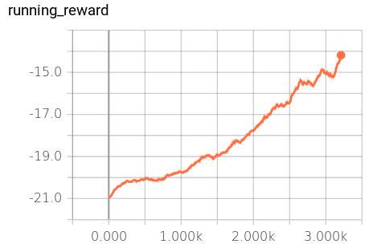
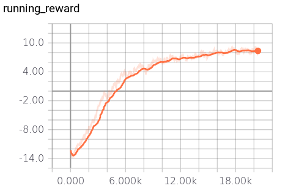

# Pong From Pixels

## Policy Gradients Using Tensorflow

[View the Blog Post](https://hollygrimm.com/rl_pg)

Here is an example game after training reward-to-go, normalizing advantages, gamma as .99, batch size as 10, and learning rate .001, for 2,300 epochs. The agent received an average reward of +8:

[MP4 Video](videos/openaigym.video.0.32451.video012000.mp4)

Chart to 300 Epochs

Chart from 300-2300 Epochs

